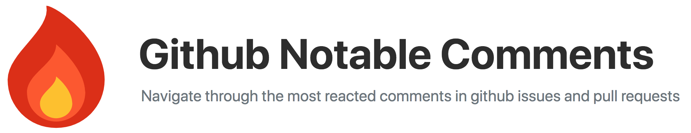
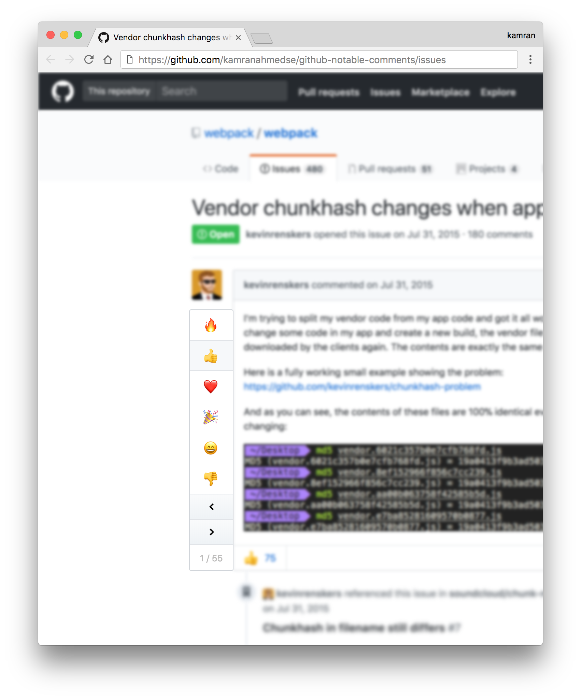
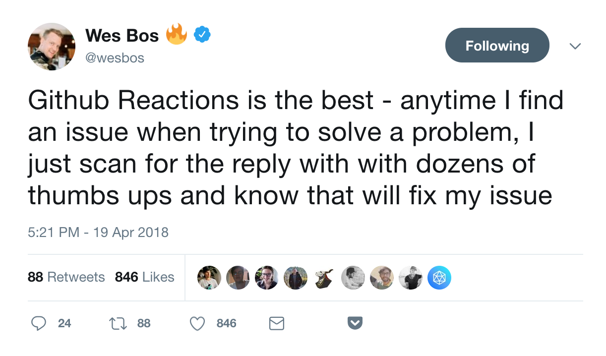

Adds a reaction navigator besides the issues and pull requests – pick a reaction and navigate through the comments with most of the selected reactions. Saves you some time when there is a large number of comments.

Install it from the [Chrome Web Store](https://chrome.google.com/webstore/detail/github-notable-comments/jcppcdjgdbnibjdeeihllbefhpibmajf) or [manually](http://superuser.com/a/247654/6877).

[Watch the video demo here!](https://streamable.com/par8b)

## Why?

Saves you time when there is a large number of comments, lets you jump to the relevant section. Just pick the 👍 or 🎉  reaction and voila!

## License
MIT © [Kamran Ahmed](https://kamranahmed.info)

